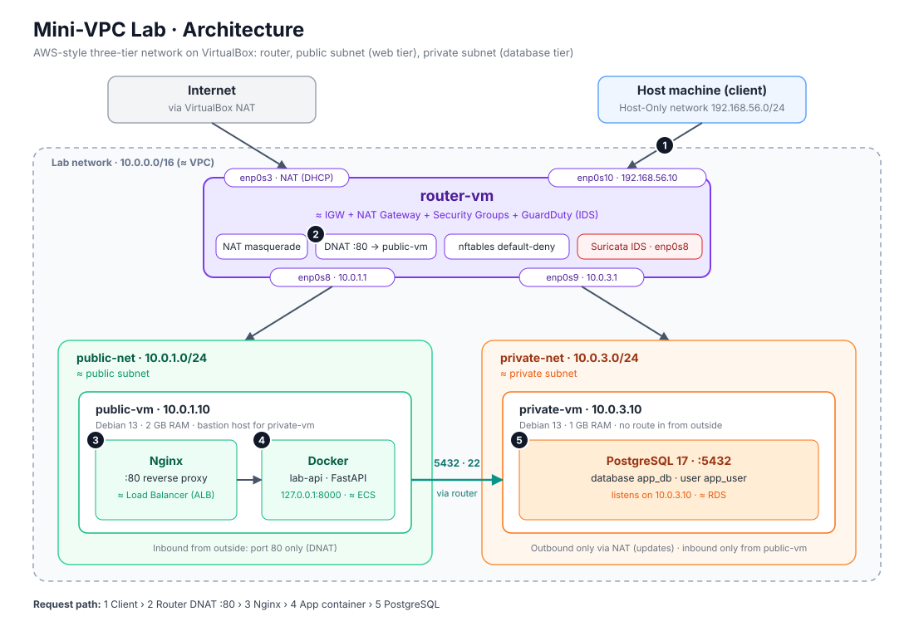

# Mini-VPC Lab

A local, AWS-style cloud networking lab built on VirtualBox. It recreates the core ideas of an AWS VPC (public and private subnets, an internet gateway, NAT, route tables, security groups, a bastion host) using real Debian virtual machines, so the concepts can be learned and practiced without an AWS account.

> Status: work in progress. The network, firewall, access paths, database tier and a demo application (FastAPI in Docker behind Nginx) are working. Intrusion detection and automation are next. See the [Roadmap](#roadmap).

## Why this project

- Prepare for the AWS Solutions Architect Associate (SAA) by understanding networking and architecture from the inside, not only from diagrams.
- Practice Linux networking: routing, NAT, firewalls, service isolation.
- Build a foundation for DevOps/DevSecOps work: automation, security monitoring, reproducible environments.
- Create a project that can later be reproduced on real AWS (for example with Terraform).

## Architecture



<details>
<summary>Text version of the diagram</summary>

```
                    Internet
                       |
              [ VirtualBox NAT ]               [ Host-Only 192.168.56.0/24 ]
                       |                                  |
                       |  enp0s3                          |  enp0s10 (192.168.56.10)
                +------+----------------------------------+------+
                |                  router VM                     |
                |   Internet Gateway + NAT + DNAT + firewall     |
                |   enp0s8 10.0.1.1          enp0s9 10.0.3.1     |
                +--------------+--------------+------------------+
                               |              |
                     public-net|              |private-net
                    10.0.1.0/24|              |10.0.3.0/24
                               |              |
                        +------+-----+  +-----+------+
                        | public-vm  |  | private-vm |
                        | 10.0.1.10  |  | 10.0.3.10  |
                        | Docker     |  | PostgreSQL |
                        +------------+  +------------+
```

</details>

- The router is the only path between the two subnets and the internet.
- The public subnet hosts the web application. Inbound traffic reaches it only through a DNAT rule on the router (port 80).
- The private subnet hosts the database tier. It can reach the internet outbound (updates, DNS) through NAT, but nothing can initiate a connection into it from outside.
- The private VM is administered through the public VM, which acts as a bastion host. The firewall allows only SSH (22) and PostgreSQL (5432) from the public VM to the private VM.
- The Host-Only adapter on the router is a management path from the host machine (SSH and testing) and plays the role of the "outside world" for the DNAT demo.

## Addressing plan

| Component | Interface | Address | Gateway |
|---|---|---|---|
| Lab address space | n/a | 10.0.0.0/16 | n/a |
| router | enp0s3 (NAT) | DHCP from VirtualBox (10.0.2.15) | VirtualBox |
| router | enp0s8 (public-net) | 10.0.1.1/24 | n/a |
| router | enp0s9 (private-net) | 10.0.3.1/24 | n/a |
| router | enp0s10 (Host-Only) | 192.168.56.10/24 | n/a (no gateway on purpose) |
| public-vm | public-net | 10.0.1.10/24 | 10.0.1.1 |
| private-vm | private-net | 10.0.3.10/24 | 10.0.3.1 |

The private subnet uses 10.0.3.0/24 on purpose: VirtualBox's default NAT network uses 10.0.2.0/24, so reusing it would cause routing conflicts.

## AWS concept mapping

| AWS concept | In this lab |
|---|---|
| VPC | The 10.0.0.0/16 address space and its isolated internal networks |
| Public subnet | public-net (10.0.1.0/24) |
| Private subnet | private-net (10.0.3.0/24) |
| Internet Gateway + public IP | Router VM with a DNAT rule forwarding port 80 to the web VM |
| NAT Gateway | nftables masquerade on the router's NAT interface |
| Route tables | Default routes on each VM pointing to the router |
| Security groups | nftables forward chain with default-deny and explicit allows |
| EC2 instances | The three Debian VMs |
| Application Load Balancer | Nginx reverse proxy on public-vm |
| ECS / container workload | The application container (Docker) on public-vm |
| RDS in a private subnet | PostgreSQL on private-vm, with a dedicated database and user for the application |
| Bastion host | public-vm as the SSH jump host |
| GuardDuty / network monitoring (planned) | Suricata IDS on the router |

## Environment

- Host: 16 GB RAM machine running VirtualBox
- Guest OS: Debian 13 (Trixie), installed from the netinst image, no desktop environment

| VM | Role | RAM | CPU | Disk |
|---|---|---|---|---|
| router | Gateway, NAT, firewall, later IDS | 2048 MB | 2 | 15 GB |
| public-vm | Web tier (Nginx, Docker) | 2048 MB | 1 | 10 GB |
| private-vm | Database tier (PostgreSQL) | 1024 MB | 1 | 10 GB |

## Firewall policy (router, forward chain, default drop)

| Flow | Decision |
|---|---|
| Established / related traffic | Allow |
| Host-Only (outside) to public-vm, TCP 80 | Allow (after DNAT) |
| public-vm to private-vm, TCP 22 | Allow (bastion access) |
| public-vm to private-vm, TCP 5432 | Allow (PostgreSQL, from public-vm only) |
| public and private subnets to internet, TCP 80/443/53, UDP 53, ICMP echo | Allow (updates, DNS, testing) |
| Anything else, including outside to private-vm | Drop |

Full rules: [`router-vm/etc/nftables.conf`](router-vm/etc/nftables.conf).

## Demo application

A small FastAPI service (see [`app/`](app/)) that records visits in PostgreSQL. Calling it from the host exercises the whole path: router DNAT, Nginx, the Docker container, the firewall between the subnets, and the database on the private subnet.

```
curl http://192.168.56.10/healthz                # service is up
curl http://192.168.56.10/db-check               # database reachable through the firewall
curl -X POST http://192.168.56.10/visits         # records a visit
curl http://192.168.56.10/visits                 # {"total": N, "last_visit": "..."}
```

## Roadmap

- [x] Phase 0: Design the topology and addressing plan
- [x] Phase 1: Install the router VM (Debian, no desktop)
- [x] Phase 2: Router networking: static IPs, IP forwarding, NAT
- [x] Phase 3: public-vm: install, verify internet access through the router, Nginx, Docker (RAM raised to 2 GB)
- [x] Phase 4a: private-vm: install, verify outbound-only access
- [x] Phase 5: Access paths: SSH from the host through the router and the bastion (ProxyJump)
- [x] Phase 6: Security groups: default-deny forward policy with explicit allows, tested both ways
- [x] Phase 4b: PostgreSQL on private-vm: a database and a dedicated user for the application, listening on its internal address only, access limited by pg_hba and the firewall
- [x] Phase 7: Demo application (FastAPI in Docker) on public-vm, behind an Nginx reverse proxy, storing data in PostgreSQL on private-vm
- [ ] Phase 8: Intrusion detection with Suricata on the router (IDS mode first)
- [ ] Phase 9: Automation (Vagrant and/or Ansible)
- [ ] Phase 10: Reproduce the architecture on real AWS with Terraform

## Documentation

- [Setup guide](docs/setup-guide.md): step-by-step build instructions
- [Troubleshooting](docs/troubleshooting.md): problems met along the way and how they were solved
- [app](app/): the demo application (FastAPI) and its Dockerfile
- [router-vm](router-vm/), [public-vm](public-vm/), [private-vm](private-vm/): per-VM notes and the configuration files used on each machine (paths mirror the real paths inside the VM)

## AWS SAA topics this lab covers

- VPC design, CIDR planning, public vs private subnets
- Internet Gateway, NAT Gateway, route tables
- Security groups and least privilege
- Bastion host pattern and network isolation
- Multi-tier architecture (web tier, database tier)
- Monitoring and threat detection concepts (GuardDuty, VPC Traffic Mirroring, Network Firewall)

## Repository layout

Each VM has its own folder. Files under `etc/` sit at the same path they have inside the VM. Files ending in `.snippet` are excerpts to merge into the existing file, not full replacements.

```
mini-vpc-lab/
  README.md
  .gitignore
  app/                         demo application (FastAPI) and its Dockerfile
    main.py  models.py  schemas.py  database.py
    Dockerfile  requirements.txt  .dockerignore  .env.example
    README.md
  docs/
    setup-guide.md
    troubleshooting.md
    images/
      architecture.svg
      architecture.png
  router-vm/
    README.md
    etc/
      network/interfaces
      nftables.conf
      sysctl.d/99-forward.conf
  public-vm/
    README.md
    etc/
      apt/sources.list
      nginx/sites-available/lab-api
  private-vm/
    README.md
    etc/
      apt/sources.list
      postgresql/17/main/
        postgresql.conf.snippet
        pg_hba.conf.snippet
    sql/
      create-databases.sql
```

## Notes and decisions

- Debian is used for all VMs for consistency (one OS, one set of commands).
- LocalStack was considered, but it only emulates AWS APIs and does not teach real networking, so real VMs are used.
- The firewall input chain on the router is still open (accept) so management access is not cut off while the lab is built. Tightening it is a planned hardening step.
- Between the public and private VMs only SSH (22) and PostgreSQL (5432) are allowed. The database port is opened from the public VM only, instead of using an SSH tunnel, which would be fragile with several services.
